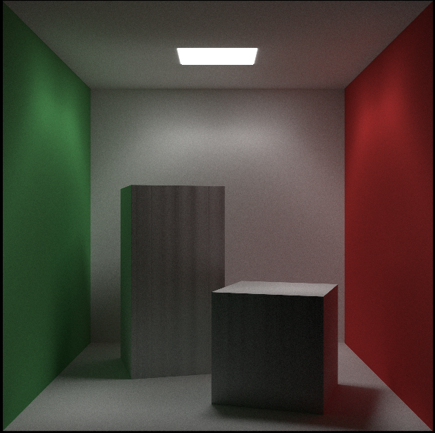

# Compute Shader Raytracing
A Compute shader based ray marcher based on the [Ray Tracing in one weekend](https://raytracing.github.io/) book series
Written in C++ using Opengl for the graphics.

#### Raytracing in one weekend: 3 Spheres

1280x720 : 100 Samples

#### Raytracing in one weekend: Final Scene

1280x720 : 100 Samples

#### Lighting Test

1280x720 : 1000 Samples

#### Unfinished Cornell Box

640x640 : 1000 Samples

#### Cornell Box

640x640 : 1000 Samples