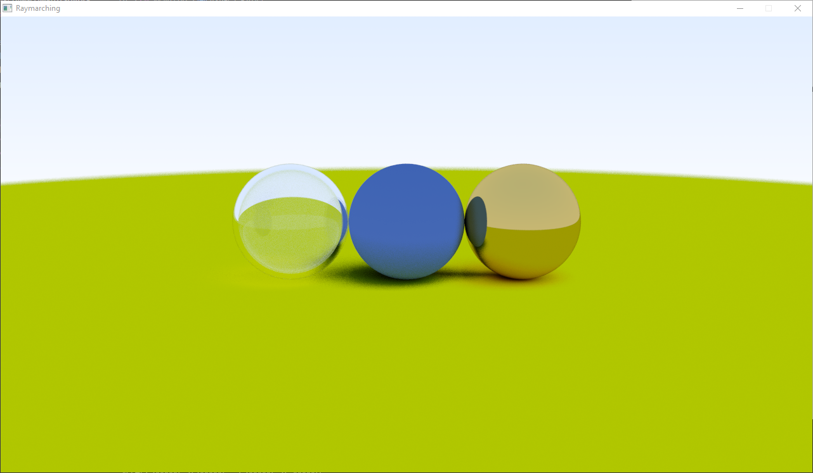
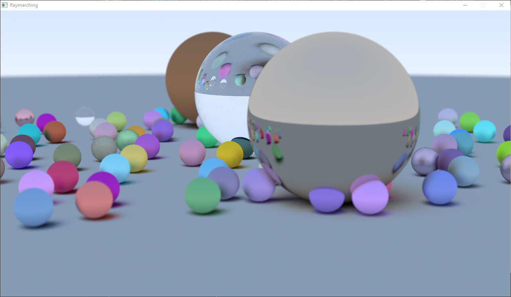
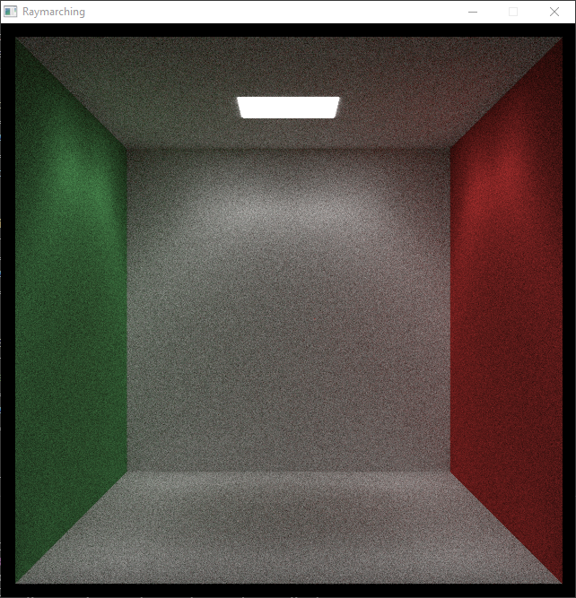
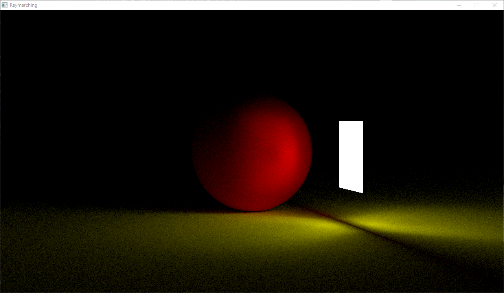

# Raymarching
A Compute shader based ray marcher based on the [Ray Tracing in one weekend](https://raytracing.github.io/) book series

Both images made with 100 samples with a max depth of 50 with a vertical fov of 20
Image size of 1280x720

600x600 Cornell box after 1000 Iterations

1280x720 Lighting test after 1000 Iterations